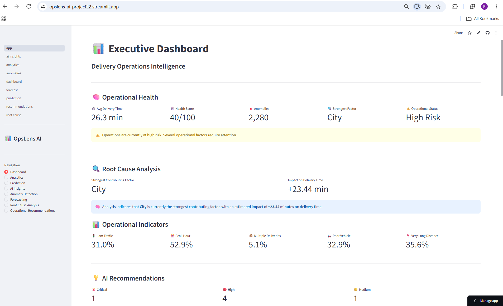
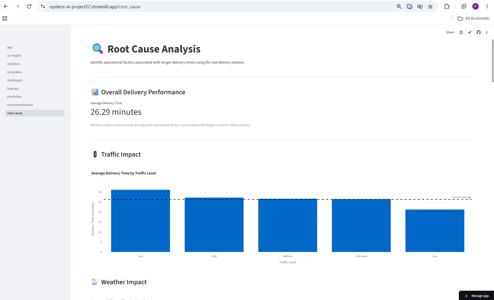
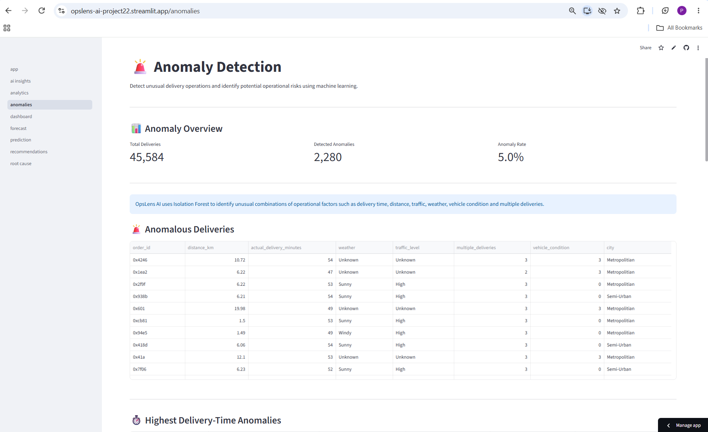
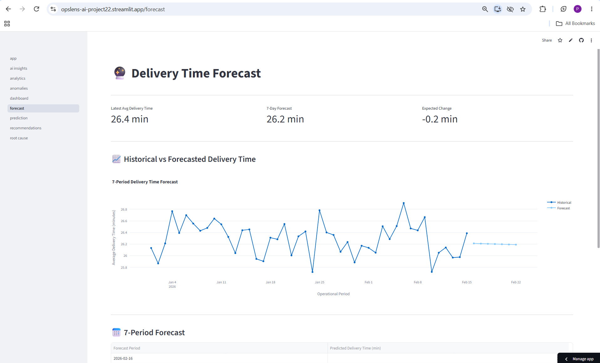
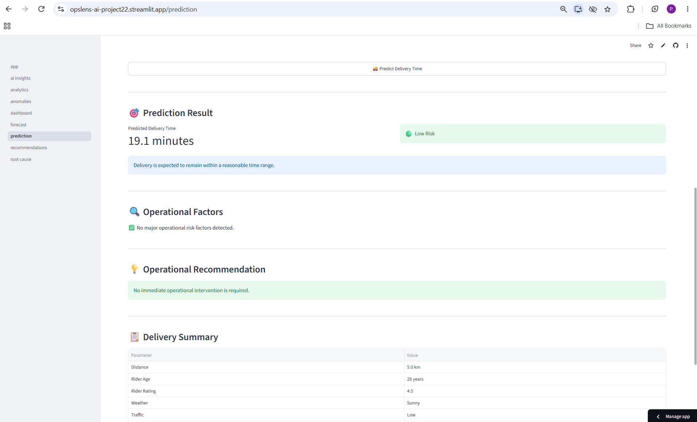
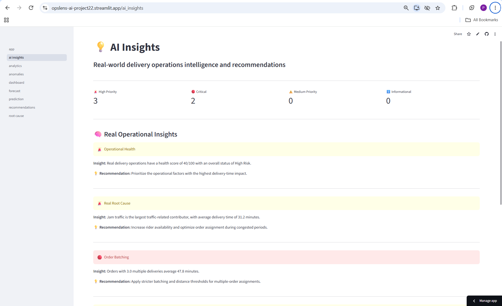
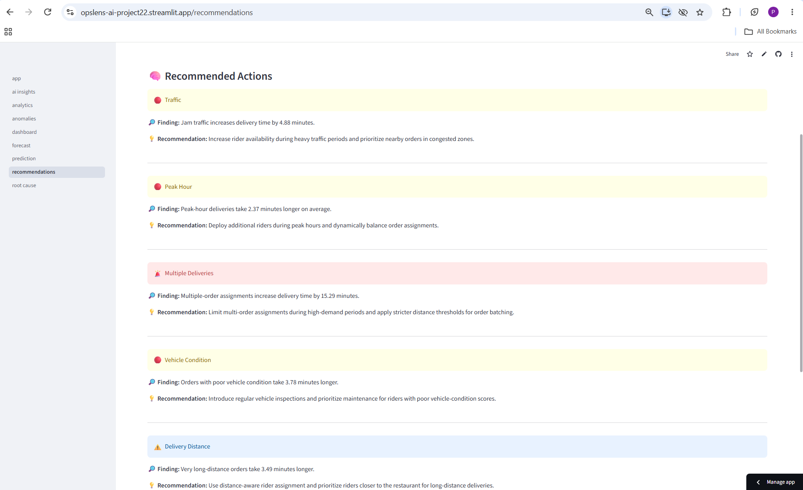
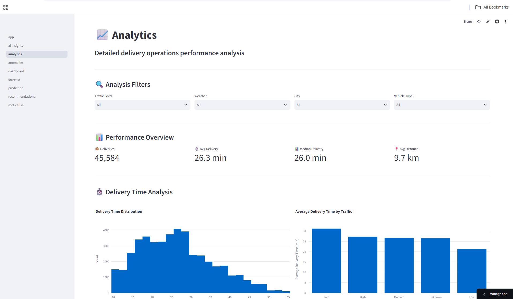

# OpsLens AI - Delivery Operations Intelligence Platform

OpsLens AI is an end-to-end data analytics and AI-powered operations intelligence platform designed to monitor, analyze, predict, and improve food-delivery operations.

It combines SQL analytics, Python, PostgreSQL, machine learning, anomaly detection, root-cause analysis, forecasting, AI insights, and automated recommendations in a single Streamlit application.

## Live Demo

**Streamlit App:**
https://opslens-ai-project22.streamlit.app/

**GitHub Repository:**
https://github.com/Prisha-22/OpsLens-AI

## Project Overview

OpsLens AI analyzes delivery operations and answers questions such as:

- Why are deliveries becoming slower?
- Which factors contribute most to delays?
- Which deliveries are anomalous?
- What delivery time should be expected?
- Where should operations teams intervene?
- What actions can reduce delivery delays?

The platform combines descriptive analytics, diagnostic analytics, predictive machine learning, and operational recommendations.

## Dataset

The project uses a cleaned Zomato-style delivery dataset containing:

- 45,584 delivery records
- 24 operational features
- Delivery time
- Distance
- Rider information
- Weather
- Traffic
- Vehicle condition
- Order type
- Vehicle type
- Multiple deliveries
- City
- Peak-hour indicators
- Weekend indicators

### Data Quality

| Metric | Result |
|---|---:|
| Total Records | 45,584 |
| Duplicate Order IDs | 0 |
| Missing Order IDs | 0 |
| Average Delivery Time | 26.29 min |
| Average Distance | 9.73 km |
| Maximum Distance | 20.97 km |

## Key Results

| Metric | Result |
|---|---:|
| Total Deliveries | 45,584 |
| Average Delivery Time | 26.29 min |
| Operational Health | 40 / 100 |
| Risk Level | High |
| Detected Anomalies | 2,280 |
| Anomaly Rate | 5.0% |

### Main Operational Findings

| Factor | Impact |
|---|---:|
| Multiple Deliveries | +15.29 min |
| Jam Traffic | +4.88 min |
| Poor Vehicle Condition | +3.78 min |
| Very Long Distance | +3.49 min |
| Peak Hour | +2.37 min |

## Features

### Executive Dashboard

Provides a high-level operational view with:

- Operational health score
- Average delivery time
- Anomaly count
- Risk level
- Root-cause indicators
- AI recommendations



### Root Cause Analysis

Identifies the operational factors contributing to delivery delays.

Key factors include multiple deliveries, traffic, vehicle condition, distance, and peak-hour conditions.



### Anomaly Detection

Detects unusual delivery patterns using operational features such as:

- Delivery duration
- Distance
- Traffic
- Weather
- Vehicle condition
- Multiple deliveries
- Peak-hour conditions



### Forecasting

Generates a 7-period delivery-time forecast based on historical operational patterns.

Because the available dataset does not contain a reliable continuous timestamp series, sequential records are grouped into operational periods for forecasting.



### Delivery Prediction

Uses a Random Forest Regressor to predict delivery duration for new delivery conditions.

Input features include:

- Distance
- Rider age
- Rider rating
- Weather
- Traffic
- Vehicle condition
- Order type
- Vehicle type
- Multiple deliveries
- Festival
- City
- Pickup hour
- Peak hour
- Weekend



### AI Insights

Converts analytical findings into business-friendly operational insights.



### Automated Recommendations

Generates operational actions based on identified risks and root causes.

Examples include recommendations for:

- Multiple delivery assignments
- Traffic management
- Peak-hour rider allocation
- Vehicle maintenance



### Analytics

Provides interactive analysis across:

- Traffic
- Weather
- Distance
- City
- Peak hours
- Multiple deliveries
- Vehicle conditions
- Delivery performance



## Technology Stack

### Programming Languages

- Python
- SQL

### Data Analysis and Processing

- Pandas
- NumPy
- Data Cleaning
- Data Validation
- Exploratory Data Analysis
- Feature Engineering

### Database

- PostgreSQL
- Neon PostgreSQL
- SQL Queries
- Relational Data Storage

### Machine Learning

- Scikit-learn
- Random Forest Regressor
- OneHotEncoder
- Feature Preprocessing
- Anomaly Detection
- Forecasting
- Predictive Modeling

### Analytics

- KPI Analysis
- Root Cause Analysis
- Operational Risk Analysis
- Segmentation
- Business Insights
- Automated Recommendations

### Visualization

- Plotly
- Matplotlib
- Streamlit Charts

### Application and Deployment

- Streamlit
- Streamlit Community Cloud
- Neon PostgreSQL

### Development Tools

- Git
- GitHub
- VS Code

## Architecture

```text
Zomato Delivery Dataset
          |
          v
Data Cleaning and Validation
          |
          v
PostgreSQL / Neon PostgreSQL
          |
     +----+----+
     |         |
     v         v
 Analytics    ML
     |         |
     +----+----+
          |
          v
     AI Insights
          |
          v
      Streamlit
          |
          v
Operational Decisions
and Recommendations
```

## Project Structure

```
OpsLens-AI/
|
├── config/
│   ├── __init__.py
│   └── settings.py
|
├── data/
│   └── real_data/
│       └── Zomato Dataset.csv
|
├── docs/
│   ├── 01_Project_Overview.md
│   ├── 02_Business_Requirements.md
│   ├── 03_KPIs.md
│   ├── 04_Dataset_Design.md
│   ├── 05_SQL_Plan.md
│   ├── 06_Python_Plan.md
│   ├── 07_Business_Process.md
│   └── 08_Database_Architecture.md
|
├── python/
│   ├── analytics/
│   ├── ingestion/
│   ├── insights/
│   ├── ml/
│   ├── visualizations/
│   ├── database.py
│   └── main.py
|
├── sql/
│   ├── 01_Basic_SQL/
│   ├── 02_Business_KPIs/
│   ├── 03_Advanced_SQL/
│   ├── create_tables.sql
│   └── README.md
|
├── streamlit/
│   ├── components/
│   ├── pages/
│   └── app.py
|
├── images/
│   ├── dashboard.png
│   ├── analytics.png
│   ├── root-cause.png
│   ├── anomalies.png
│   ├── forecast.png
│   ├── prediction.png
│   ├── recommendations.png
│   └── ai-insights.png
|
├── reports/
├── notebooks/
├── requirements.txt
├── .gitignore
└── README.md
```

## Setup

### 1. Clone the Repository

```bash
git clone https://github.com/Prisha-22/OpsLens-AI.git
cd OpsLens-AI
```

### 2. Create a Virtual Environment

```bash
python -m venv venv
```

### 3. Activate the Virtual Environment

**Windows:**

```bash
venv\Scripts\activate
```

**macOS or Linux:**

```bash
source venv/bin/activate
```

### 4. Install Dependencies

```bash
pip install -r requirements.txt
```

### 5. Configure the Database

For local development, configure PostgreSQL using environment variables.

Example:

```bash
DB_HOST=localhost
DB_NAME=opslens_ai
DB_USER=postgres
DB_PASSWORD=your_password
DB_PORT=5432
```

For Streamlit Community Cloud, configure the Neon PostgreSQL connection using Streamlit Secrets.

Example:

```markdown
```toml
DATABASE_URL = "your_neon_connection_string"

> Never commit database passwords, API keys, connection strings, or other credentials to GitHub.

### 6. Run the Application

From the project root:

```bash
python -m streamlit run streamlit/app.py
```

The application will open in your browser.

## Live Deployment

The application is deployed using:

- GitHub
- Streamlit Community Cloud
- Neon PostgreSQL

Live application: https://opslens-ai-project22.streamlit.app/

## Key Business Insights

**Traffic**
Jam traffic increases average delivery time by approximately 4.88 minutes.

**Peak Hours**
Peak-hour deliveries take approximately 2.37 minutes longer than non-peak deliveries.

**Multiple Deliveries**
Multiple-order assignments have one of the strongest operational impacts and substantially increase delivery time.

**Vehicle Condition**
Poor vehicle condition is associated with approximately 3.78 additional minutes.

**Distance**
Very long-distance deliveries take approximately 3.49 minutes longer.

**City Operations**
Semi-Urban deliveries show significantly higher delivery times and represent a major operational risk area.

## Project Workflow

```
Raw Data
   |
Data Cleaning
   |
Data Validation
   |
PostgreSQL
   |
SQL Analytics
   |
Python Analytics
   |
Root Cause Analysis
   |
Machine Learning
   |
AI Insights
   |
Recommendations
   |
Operational Decisions
```

The project follows the workflow: **Data → Insight → Prediction → Action**

## Future Improvements

- Real-time delivery monitoring
- Live traffic integration
- Demand forecasting
- Rider allocation optimization
- Delivery-zone heatmaps
- Explainable ML with SHAP
- Automated alerts
- Model performance monitoring
- Production API using FastAPI

## Author

**Prisha Shah**
M.Sc. Applied Data Science
SRM Institute of Science and Technology

GitHub: https://github.com/Prisha-22/OpsLens-AI